# Hands-on: Docker Images

# Start the AWS EC2 instance running Docker

Access AWS, navigate to EC2, and then start the VM created for Docker usage.

# Cleaning the Environment:

Clean your Docker environment:

```
docker system prune -a -f --volumes

```

Create a new directory and switch to it:

```
mkdir docker-images
cd docker-images

```

Create a index.html file with the content below:

```html
<!DOCTYPE html>
<html lang="en">
<head>
    <meta charset="UTF-8">
    <meta http-equiv="X-UA-Compatible" content="IE=edge">
    <meta name="viewport" content="width=device-width, initial-scale=1.0">
    <link rel="preconnect" href="https://fonts.googleapis.com">
    <link rel="preconnect" href="https://fonts.gstatic.com" crossorigin>
    <link href="https://fonts.googleapis.com/css2?family=Roboto+Mono:wght@100&display=swap" rel="stylesheet">
    <link rel="stylesheet" href="style.css">
    <title>TCB: Python Image</title>
</head>
<body>
    
     <h1>This is The Cloud Bootcamp</h1>
     <h2>DevOps Cloud Bootcamp</h2>

     
    
</body>
</html>
```

Create a style.css file with the content below:

```css
body{
    padding: 0;
    margin: 0;
    border: 0;
    background: rgb(24, 27, 30);
    text-align: center;
    font-size: 20px;    
}

h1{
    padding-top: 50px ;
    color: rgb(11, 237, 105);
    transition: 4s;
    font-family: roboto mono;    
}

h2{
    color: rgb(11, 237, 105);
    transition: 5s;
    font-family: roboto mono;
}
```

# Dockerfile:

Create a Dockerfile:

```docker
FROM python:2.7
WORKDIR /html
COPY index.html .
EXPOSE 3000
CMD python -m SimpleHTTPServer 3000

```

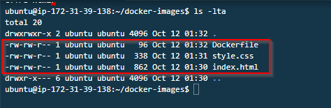
---

**Note:** SimpleHTTPServer is a Python module that allows you to instantly create a web server or serve your files easily. You don't need to install anything as long as you have Python interpreter installed.

---

Build the Docker image:

```
docker build . -t python-simple-httpserver:v1.0

```
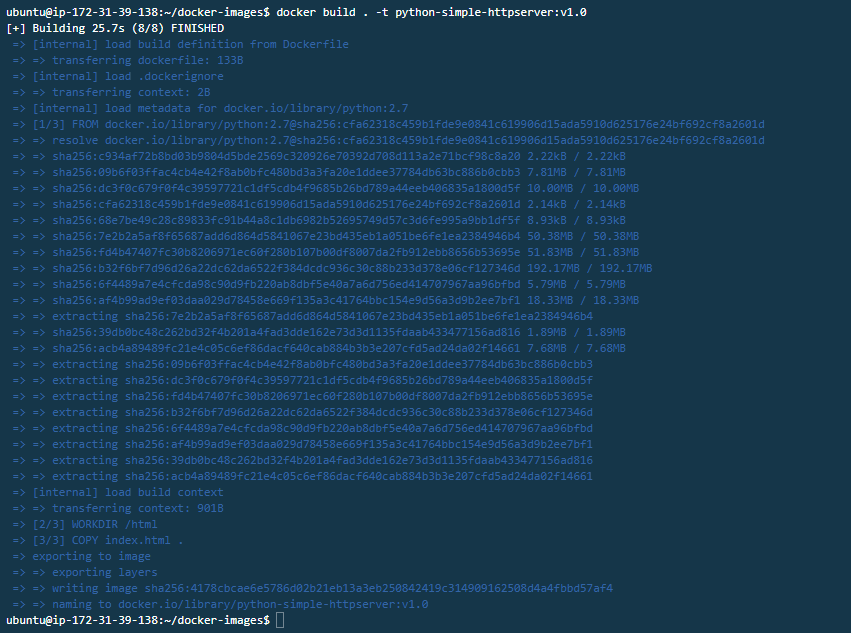
Check your Docker images:

```
docker images

```
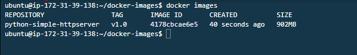


Create and Start a new Docker Container using the Docker image created:

```
docker run --rm -d -p 8080:3000 --name httpserver1 python-simple-httpserver:v1.0

```
After running the docker container check the running instances. 
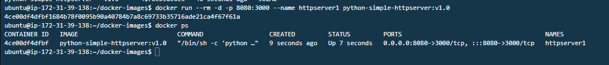

<aside>
💡 Test the webserver on post 8080. You’ll notice it will fail because you need to allow the port on Security Group. Open the port on the respective security group.

</aside>
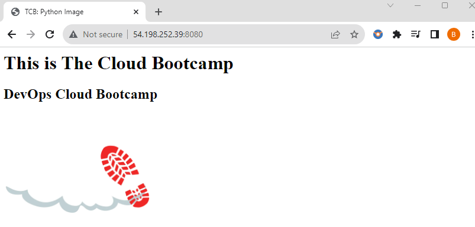

# Changing the Dockerfile:

Change the Dockerfile to now COPY all files to the Docker image:

```docker
FROM python:2.7
WORKDIR /html
**COPY . .**
EXPOSE 3000
CMD python -m SimpleHTTPServer 3000

```

Build the Docker image:

```
docker build . -t python-simple-httpserver:v2.0

```
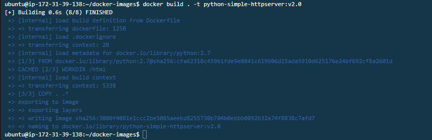
Check your Docker images:

```
docker images

```
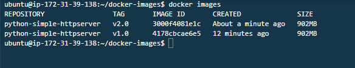
Create and Start a new Docker Container using the new image:

```

docker run --rm -d -p 8081:3000 --name httpserver2 python-simple-httpserver:v2.0

```
Our 2 docker versions are live but running on separate ports 
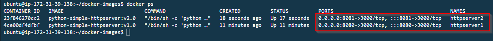

Now we can test version 2 of our application via the browser after editing the Dockerfile. Everything is working perfectly okay 
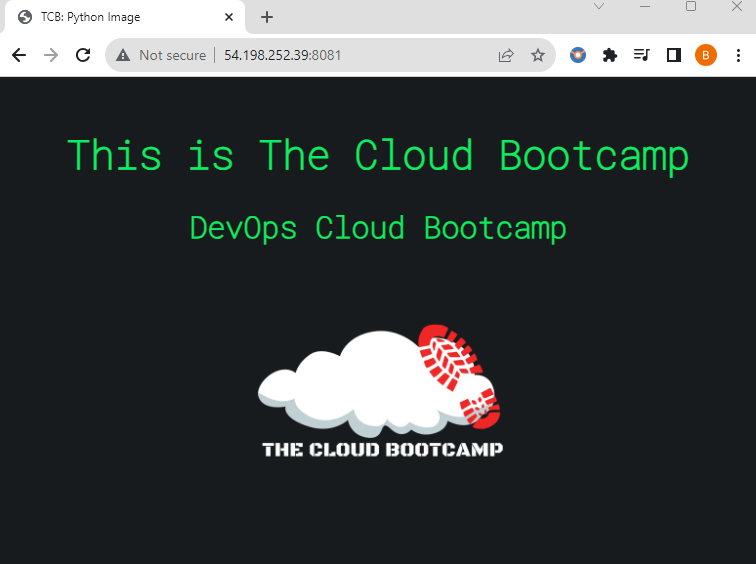

# Create a free account on DockerHub
Follow the link below to create a free account on DockerHub where you will be able to push your images. 

[https://hub.docker.com](https://hub.docker.com/)

# Docker Tag:

Tag your Docker image:

```
docker tag <imageid> <userid>/python-simple-httpserver:v2.0

```
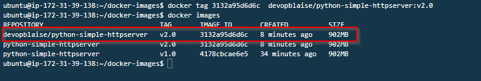

# Docker Push:
To push your image to the Dockerhub repository you need to login via you terminal with your dockerbub credential. 

```
docker login

```
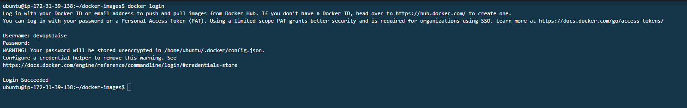

# Push your Docker image to the repository:
Now all we  have to do is pust our image to the dockerhub repo.

```
docker push <userid>/python-simple-httpserver:v2.0
```
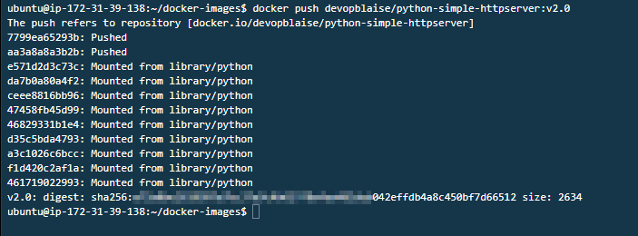

let's chech our dockerhub repo to for make sure our images was pushed. 
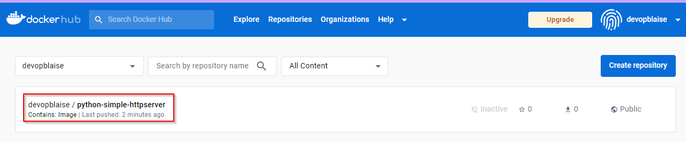

# Docker Container Process Info:

we can also get more information from  a running processes in a container like user ID, Process ID, start time of a process, the command started the process and how many times it has been executed using the following commands. 

```
docker top <containerid>
```
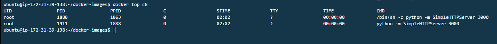

Statistics bout our running docker container such as CPU usage, memory usage, network etc. can be gotten using the following.

```
docker stats 
```
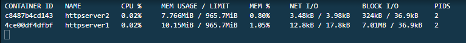